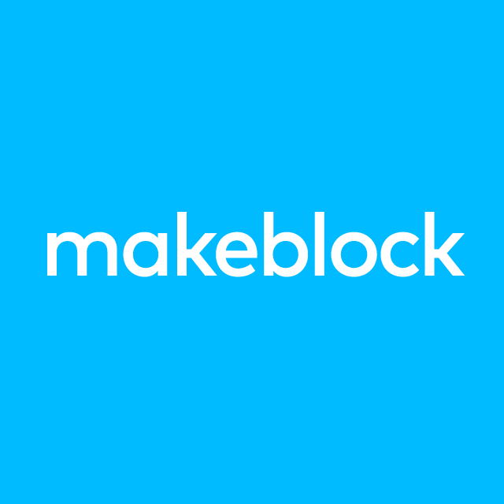

<body>
            <h2>Welcome!</h2>
            <h2>
                Hi! 👋 I´m OSSAB!   I´m a 14-year old coder from Santiago, Chile.
            </h2>   
            

                        I like to do mtb, play video games, and more. I also like to constantly learn new programming languages, frameworks, and much more!
            

            

                        <h1>Some of my projects are ...</h1>
                        <ul>
                                    <li>CatLang NPM - A NPM package that combines CSharp with Javascript and Typescript. This is an open-source project</li>
                                    <li>ossabprojects - This is my first personal website, where i upload some of my projects and more. Made with ReactJs. This is an open-source project.</li>
                                    <li>MongoMobile - This is an app to explore MongoDB Clusters data. This is my first android app. Made with Java. Currently under development. This is an open-source project.</li>
                        </ul>
            

            

                        <h1>Programming skills</h1>
                

                 Web Development  
                 Discord Bots  
                 Videogames Development (Unity5) 
                 Desktop Applications  
                 Makeblock Robots  
                

            

            <h2>
             
            </h2>
            

                        <h1>Programming Languages</h1>
                

                 JavaScript  
                 Java  
                 C#  
                 C++  
                

            

</body>
