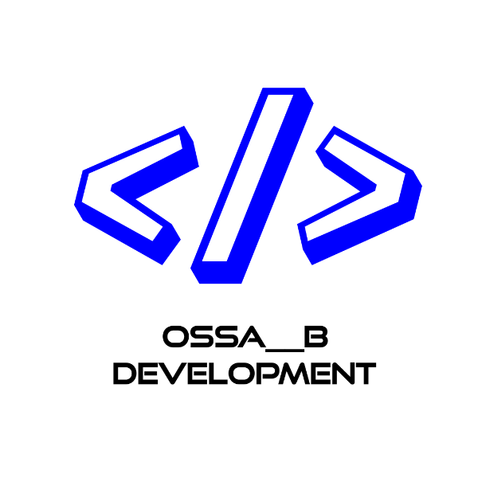

    

            <a href="https://github.com/OSSAHUB" target="_BLANK">Github</a>
            <a href="./servicios.html">Servicios</a>
            <a href="./proyectos.html">Proyectos</a>
            <a href="./multipana.html" class="mp">MultiPana</a>
            <a class="activo" href="index.html">Inicio</a>
            
            

            

            <h1>OSSA__B Development</h1> 
            <h2>Hola :3 Te doy la bienvenida a mi página web! Aquí publicaré proyectos y muchas cosas más!</h2>
            

            <h2 class="parrafo">
                Hola! 👋 Soy OSSA__B!   Mis intereses en la informática son:
            </h2>
            

                

                 Desarrollo web  
                 Bots de discord  
                 Desarrollo de videojuegos en Unity 3D (Recién empezando)  
                 Aplicaciones de escritorio (Actualmente solo electron.js)  
                 Robótica en makeblock  
                

            

            <h2 class="parrafo">
              Los lenguajes de programación que actualmente uso son:
            </h2>
            

                

                 JavaScript  
                 HTML 5  
                 CSS 3  
                 C#  
                 Java  
                

            

            <h2 class="parrafo">
                  Estadísticas:
                </h2>
                

                    <h1>Proyectos en desarrollo:</h1>
                    <h2></h2>
                

                

                    <h1>Proyectos terminados:</h1>
                    <h2></h2>
                

             
             
            <footer class="footer">Copyright © OSSA__B Development | Todos los proyectos ya sean públicos o privados están sujetos a derechos de autor bajo la licencia <a href="https://www.apache.org/licenses/LICENSE-2.0" target="_BLANK">Apache 2.0</a> y está prohibida la copia. Son solo para referencias para tus proyectos.</footer>
